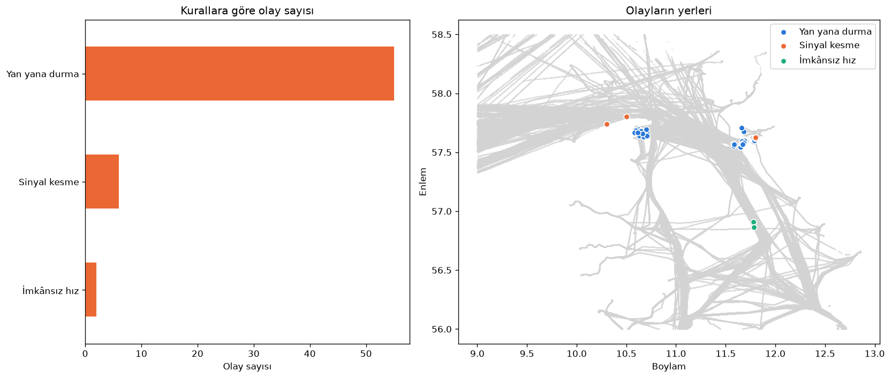
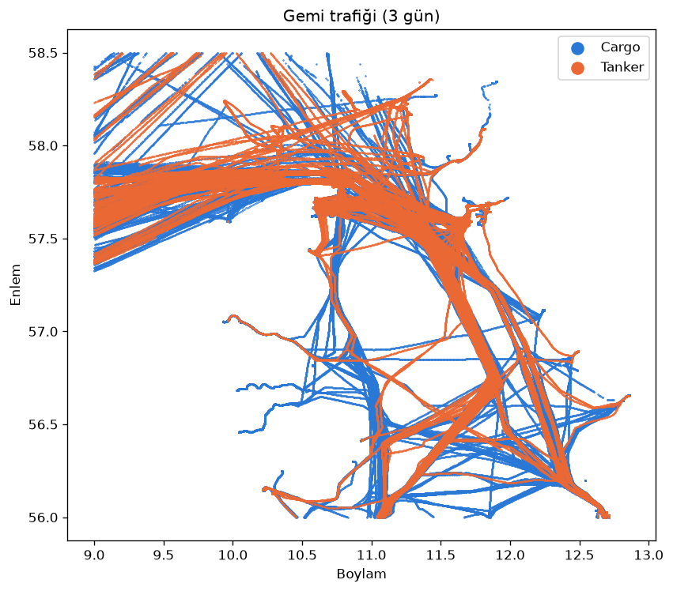

# SeaSentinel

Gemilerin yayınladığı konum verisine (AIS) bakıp basit kurallarla tuhaf davranan gemileri bulmaya çalıştığım küçük bir
veri analizi projesi. Denizcilik sektöründe staj yaptığım için gemi verisi ilgimi çekti.



## Veri

Danimarka Denizcilik Otoritesi'nin açık AIS arşivi: http://aisdata.ais.dk/

- Tarihler: 29 Eylül – 1 Ekim 2026 (3 gün)
- Bölge: Danimarka ile İsveç arasındaki Kattegat ve Skagen
- Gemiler: sadece yük gemileri ve tankerler
- 507 gemi, 515.164 konum kaydı (`ais_kattegat.parquet`)

Ham veri çok büyük olduğu için (günde ~5 GB) bölgeye göre süzülmüş ve gemi başına dakikada bir noktaya indirilmiş
halini kullandım.

## Ne yaptım?

Üç basit kural yazdım:

| Kural | Ne zaman şüpheli? |
|---|---|
| Sinyal kesme | Gemi 2 saatten uzun süre hiç sinyal göndermemiş (limanda bağlı duranlar hariç) |
| İmkânsız hız | Gemi iki sinyal arasında 40 knot'tan (saatte ~74 km) hızlı gitmiş görünüyor |
| Yan yana durma | İki gemi açık denizde en az 1 saat boyunca 500 metreden yakın ve neredeyse durur halde kalmış |

Tüm adımlar ve açıklamalar: [`gemi_analizi.ipynb`](gemi_analizi.ipynb)

## Sonuçlar

3 günde **63 olay** ve **30 farklı gemi** buldum:

| Olay | Sayı |
|---|---:|
| Yan yana durma | 55 |
| Sinyal kesme | 6 |
| İmkânsız hız | 2 |

- **Yan yana durma** olaylarının neredeyse hepsi Skagen ve Göteborg açıklarında. En çok olaya karışan gemilerin hepsi
  tanker. Büyük ihtimalle demirli gemilere yakıt veren tankerler; yani bu davranış her zaman şüpheli değil.
- **Sinyal kesme:** LIBRA adlı gemi Göteborg açığında 3 ile 10 saat arasında 4 kez sinyal göndermeyi bırakmış.
- **İmkânsız hız:** SEACOD adlı geminin konumu yaklaşık 1 dakikada 4,8 km sıçramış (~190 knot), gerçek olamaz.

Bütün olaylar `olaylar.csv` dosyasında; Excel ya da Power BI ile açılabilir.



## Nasıl çalıştırılır?

```bash
pip install -r requirements.txt
jupyter notebook gemi_analizi.ipynb
```

## Eksikler

- Sadece 3 günlük veri ve tek bir bölge kullandım.
- Kuralların eşikleri (2 saat, 40 knot, 500 metre, 1 saat) benim seçtiğim değerler.
- Gemi adı ve tipi gemilerin kendisi tarafından giriliyor, yanlış olabilir.
- Gerçekten şüpheli olduğu bilinen gemilerin listesi olmadığı için kuralların doğruluğunu ölçemedim.
- Bir olay bulunması geminin suç işlediği anlamına gelmiyor, sadece "buna bir bakmak lazım" demek.

## Lisans

Kod MIT lisanslı. AIS verisi Danimarka Denizcilik Otoritesi'ne ait.
